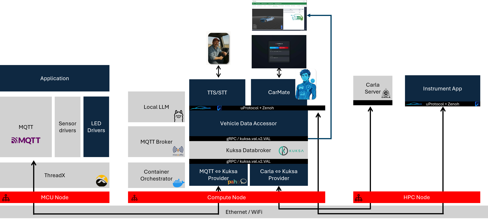

# SDV Blueprint - CarMate

CarMate is an AI-powered in-vehicle companion blueprint for Software Defined Vehicle (SDV) architectures. It enhances driver well-being, safety, and interaction by combining real-time vehicle data, conversational AI, and safe human-machine interfaces.

## Getting Started

For setup and deployment instructions, start with the [CarMate Getting Started Guide](Manual.md).

## Goal

This blueprint demonstrates an end-to-end SDV architecture for an AI-powered in-vehicle companion named CarMate.

CarMate integrates real-time vehicle data, AI-driven conversational interaction, and safe human-machine interfaces into a reproducible SDV reference architecture.

The blueprint connects:

- In-vehicle data sources, including MCU sensors, simulation data from CARLA, and vehicle signals
- Vehicle middleware and orchestration components, including VSS-based data models, MQTT providers, Eclipse Kuksa Databroker, and digital.auto
- AI interaction components, including speech processing, conversational AI, and LLM integration
- User interface and visualization components, including cluster display and Web UI

The goal is to provide a reusable and extensible SDV blueprint based on open-source components, aligned with COVESA Vehicle Signal Specification (VSS) semantics, and suitable for future integration with broader SDV capabilities such as service mesh, orchestration, authentication, and authorization.

## Use Case

This blueprint focuses on a driver companion scenario for long-distance drivers, such as truck drivers and commuters.

The AI companion combines emotional engagement, contextual awareness, and intelligent vehicle interaction.

Example use cases include:

- Capturing driver voice input and converting it into structured commands via speech-to-text
- Mapping vehicle and environmental data, such as temperature, weather, and simulation data, into VSS signals
- Enabling conversational AI to respond socially and reduce driver loneliness
- Providing contextual driving insights, such as weather and road condition information
- Controlling selected vehicle features, such as ambient lighting
- Supporting bidirectional interaction between driver, AI, vehicle systems, and vehicle data feedback
- Visualizing key vehicle data and AI-generated insights in the cluster display and Web UI

## Technical Architecture

The CarMate blueprint is organized across three connected nodes:

- MCU Node: runs the ThreadX-based sensor and LED drivers and publishes sensor data through MQTT.
- Compute Node: hosts the containerized SDV services, including the MQTT broker, MQTT-Kuksa provider, CARLA-Kuksa provider, Kuksa Databroker, Vehicle Data Accessor, TTS/STT, CarMate agent, and local or external LLM backend.
- HPC Node: runs the CARLA server and instrument app, connected through uProtocol and Zenoh.

Vehicle and simulation data flow from the MCU node and CARLA environment into the Kuksa Databroker as VSS-aligned signals. CarMate reads this vehicle context through the Vehicle Data Accessor, combines it with speech and LLM interaction, and returns feedback to the driver-facing UI, instrument app, or selected vehicle functions.

## Used Technologies and Tools

This blueprint builds upon the following open-source projects and technologies:

- Eclipse Kuksa: https://eclipse-kuksa.github.io/kuksa-website/
- Eclipse Mosquitto: https://mosquitto.org/
- Eclipse Zenoh: https://zenoh.io/
- CARLA Simulator: https://carla.org/
- COVESA VSS: https://covesa.github.io/vehicle_signal_specification/
- Eclipse AutoWRX: https://github.com/eclipse-autowrx
- Docker: https://www.docker.com/
- Ollama: https://ollama.com/

## Future Work

### 1. Emotion and Driver State Awareness

Enhance CarMate with driver monitoring capabilities, such as voice tone analysis and camera-based detection, to infer fatigue, stress, or mood. This would allow the AI to adapt conversations, suggest breaks, or reduce interaction intensity for safer driving.

### 2. AI Optimization

Move from reactive responses to proactive intelligence. CarMate could anticipate driver needs based on context, route, time, and habits, such as suggesting rest stops, warning about upcoming hazards, or preparing vehicle settings in advance.

### 3. Integration with Advanced Vehicle Systems

Expand beyond basic signals to integrate with ADAS and infotainment systems, such as navigation and driver assistance alerts. CarMate could proactively explain warnings, assist in decision-making, or provide contextual driving guidance.

### 4. Multi-User and Personalization Profiles

Introduce driver profiles with memory and preferences, such as language, tone, and favorite settings. CarMate could recognize different drivers and adapt behavior, making the experience more personalized and consistent across trips.

## Acknowledgement

This blueprint is built upon and further developed from the [ArBytesMoral](https://github.com/Eclipse-SDV-Hackathon-Chapter-Three/ArBytesMoral) project, which was created during the Eclipse SDV Hackathon Chapter Three.

We sincerely thank all contributors and team members of ArBytesMoral for their foundational work that made this blueprint possible.

## License

Licensed under the Apache License 2.0.

SPDX-License-Identifier: Apache-2.0

## Contributing

Please see [CONTRIBUTING.md](CONTRIBUTING.md) and ensure compliance with the
[Eclipse Contributor Agreement (ECA)](https://www.eclipse.org/legal/ECA.php).

## Notice

See [NOTICE](NOTICE).

## Copyright

Copyright (c) 2025 Eclipse Foundation and contributors.
